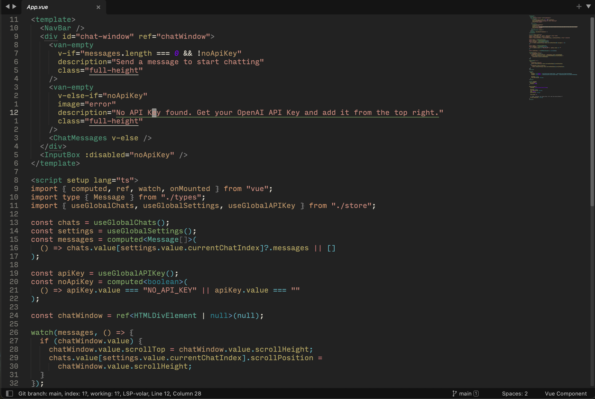

# Sublitesse Color Theme

A color theme for Sublime Text 4. 

The Sublitesse color theme is a near direct port of [Ant Fu's "Vitesse" VS Code Theme](https://github.com/antfu/vscode-theme-vitesse), 
with a few changes to fit my liking. 

## Sublime Text 3 and 4

  

## Installation

### Manual

You can also install the theme manually:

1. [Download the .zip](https://github.com/Briles/snazzy-sublime/archive/master.zip)
2. Extract the contents of the .zip to your Sublime Text `Packages` directory, which you can find using the menu item `Sublime Text -> Preferences -> Browse Packages...`

---

## License

[MIT](https://en.wikipedia.org/wiki/MIT_License)
